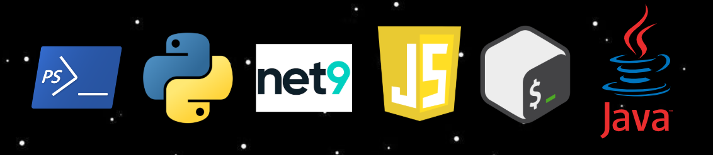

# GenerateRandomPassword 🔐
This repository contains a variety of scripts developed in different technologies and programming languages, all designed to generate random passwords. Each script offers different approaches and algorithms to create secure, robust, and hard-to-guess passwords, tailored to various requirements and use cases. Whether you need passwords for personal accounts, enterprise systems, or specific applications, this collection of tools allows you to generate reliable credentials quickly and efficiently. The range of scripts and technologies available in this repository facilitates integration into diverse environments and workflows, helping to improve the security of your systems and adhere to best practices in password management.

<div align="center">
  
</div>

### Run script 🚀
- Bash: cd bash
```
sh GeneratePassword.sh
sh GeneratePasswordWithOpenSsl.sh
```

- csharp
```
cd csharp
dotnet run
```

- Java: compile and run
```
cd Java
javac GeneratePassword.java
java GeneratePassword
```

- Javascript
```
cd Javascript
node GeneratePassword.js
```

- Powershell:
```
cd Powershell
.\GeneratePassword.ps1
```

- Python:
```
cd Python
py GeneratePassword.py
```
